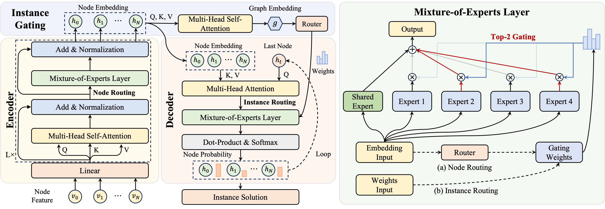

# Towards Generalization-Oriented Models for Vehicle Routing Problems with Mixture-of-Experts

This repository contains the official implementation of the manuscript **“Towards Generalization-Oriented Models for Vehicle Routing Problems with Mixture-of-Experts”**.

We provide the code and pretrained results for both **CVRP** and **TSP**. All pretrained checkpoints used in our experiments are released to ensure that the reported results are fully reproducible.

---

## Pipeline Overview

The overall pipeline of the proposed method is illustrated below.

<p align="center">
  
</p>

---

## Overview

This project focuses on building **generalization-oriented models** for vehicle routing problems based on a **Mixture-of-Experts (MoE)** framework. We provide implementations for both **Capacitated Vehicle Routing Problem (CVRP)** and **Traveling Salesman Problem (TSP)**.

To ensure a fair comparison, all datasets used in this repository are kept consistent with those provided by [AMDKD](https://github.com/jieyibi/AMDKD).

We also release pretrained checkpoints for all problem types and scales considered in our experiments, so that the reported results can be reproduced directly.

---

## Dependencies

The code has been tested with the following main dependencies:

- `matplotlib==3.5.3`
- `numpy==1.23.4`
- `pandas==1.5.2`
- `pytz==2022.1`
- `torch==1.10.2`

---

## Quick Start

Please first enter the corresponding problem folder, i.e., **CVRP** or **TSP**, and then run:

```bash
python moe.py
```

This script provides a quick start for training or running the MoE-based model.

If you need to adjust the experimental settings, you can directly modify the corresponding parameters in `moe.py`.

---

## Dataset

All datasets used in this repository are consistent with those provided by [AMDKD](https://github.com/jieyibi/AMDKD), in order to ensure fairness in comparison.

Please prepare the datasets following the same settings and conventions as AMDKD.

---

## Pretrained Checkpoints

We release pretrained checkpoints for **all problem scales** and **all problem types** considered in our experiments.

By using the provided pretrained weights together with the same dataset setting as AMDKD, the reported results can be reproduced.

---

## Inference and Evaluation

During the inference stage, you can evaluate a trained model by running:

```bash
python test.py
```

Before testing, you need to pay special attention to the following parameters:

### `env_params`

- `problem_size`
- `pomo_size`
- `load_path`

These settings should be consistent with the scale of the target problem and dataset.

### `tester_params`

- `path`

This parameter is used to specify the path of the pretrained checkpoint.

### `model_params`

The configuration in `model_params` must remain consistent with the corresponding checkpoint configuration. Otherwise, conflicts may occur when loading the pretrained model.

In particular, please make sure that:

- the problem scale matches the checkpoint
- the model configuration matches the checkpoint
- `problem_size`, `pomo_size`, and `load_path` are set consistently

---

## Recommended Workflow

A typical workflow is as follows:

1. Enter the corresponding problem folder, i.e., **CVRP** or **TSP**
2. Modify the parameters in `moe.py` if needed
3. Run `python moe.py` for quick start
4. Make sure that the test configuration matches the pretrained checkpoint configuration
5. Run `python test.py` for evaluation

---

## Notes

- Please make sure that all datasets follow the same settings as [AMDKD](https://github.com/jieyibi/AMDKD).
- Please make sure that the selected pretrained checkpoint matches the target problem type and scale.
- In the testing stage, `problem_size`, `pomo_size`, and `load_path` should remain consistent.
- The configuration in `model_params` must match the checkpoint configuration to avoid loading conflicts.

---

## Acknowledgement

We sincerely thank the authors of the following open-source repositories for making their code publicly available:

- [AMDKD](https://github.com/jieyibi/AMDKD)
- [POMO](https://github.com/yd-kwon/POMO)

Their valuable contributions have provided important inspiration and support for this work.